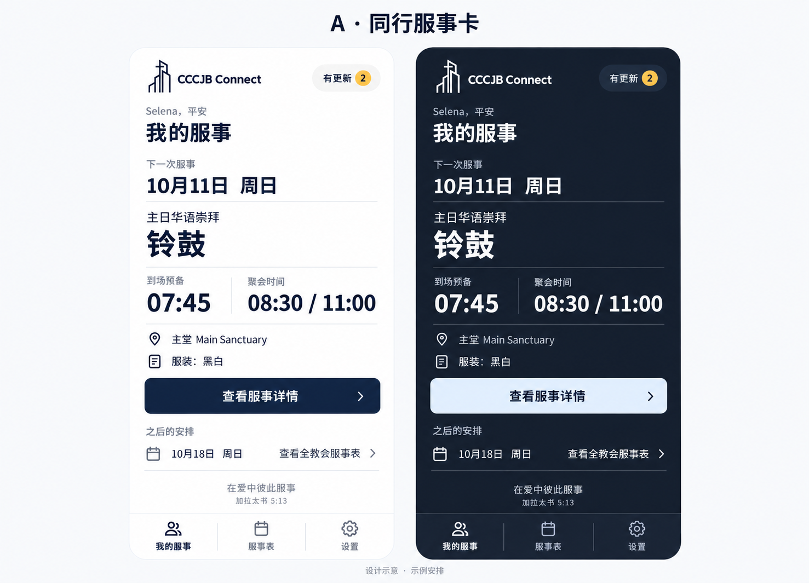
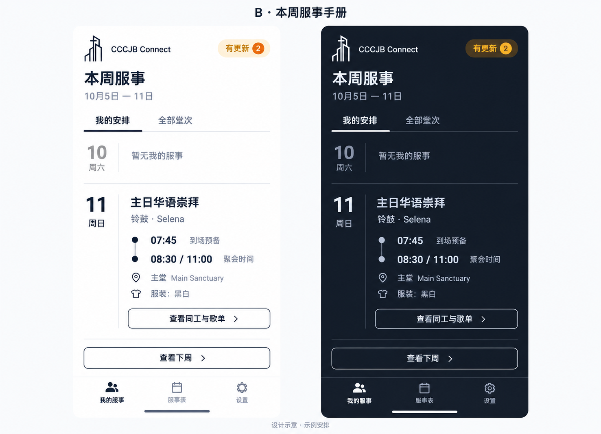

# CCCJB Connect 手机端审查与改版提案

日期：2026-10-04，Asia/Kuala_Lumpur。状态：**待批准，尚未实施**。

建议选择 **A「同行服侍卡」**，以「我什么时候到、在哪里、做什么、要注意什么」为首页核心；完整侍奉表采用按日期分组的列表。

## 1. 审查范围与证据

已读取目标文件、用户提供的 AGENTS.md 指引、仓库配置、全部主要页面与弹层相关源码、ChurchContext、类型、初始数据、WhatsApp 格式化代码、i18n 和 PWA 入口。此仓库及适用父目录中未找到额外 AGENTS.md。未加载 David-Vault。

技术基础为 React 19 / TypeScript 6 / Vite 8 / Tailwind 4 / Lucide React，采用 React Context + LocalStorage，没有后端。保留这套基础。

浏览器最初打开的 5173 来自另一份 checkout，后续审查使用当前工作目录的独立预览 `127.0.0.1:5187`；本目录内截图均来自后者。以 390×844 审查主页面与主要弹层，并在 320×812、375×812、430×932 抽查窄屏、深色及英文。没有提交排班、人员、堂次或歌曲更改，没有发送 WhatsApp。

这属于实施前审查，**不是改版后的全流程验收**。尚未做真机键盘、VoiceOver、独立安装和离线冷启动验证；隐藏彩蛋采用源码审查。实施后的 lint、build 和完整视口验收仍待进行。

原有未提交改动：`src/components/BottomNav.tsx`、`src/components/BottomPullEasterEgg.tsx`，以及已有的排班助手文档。本轮没有修改这些内容。新增内容仅为本审查文件、参考图片，以及汇总已确认产品约束的 `PRODUCT.md`。

## 2. 每个页面与弹层的问题

| 页面 / 状态 | 发现与影响 | 改版决策 |
| --- | --- | --- |
| 首页 / 我的服侍 | 问候渐变卡、经文、安装提示先于服侍内容；390px 首屏第一项还是 10月2日的过去安排。只显示准备时间，缺少聚会开始时间及岗位备注。所谓「本月」计数实际来自全部已存安排。 | 第一内容就是今日/下一次服侍；时间、地点、岗位和备注同时出现；过去记录另收起，取消误导性统计。 |
| 完整侍奉表 | 四个堂次、八个筛选项、进度、小标签、主题与歌单竞争注意力。六首歌默认展开，人员名单落到很下面。服务切换默认最早日期。 | 日期与堂次选择、重要提醒、人员安排先出现；歌单与主题为可展开段落；默认今日或最近将来安排。 |
| 编辑侍奉表 | 入口、状态和完成按钮很小；移除指派、标签、歌曲会直接生效。「完成」实际只是退出模式，不是保存草稿。 | 持续显示编辑者和编辑状态；草稿明确标记；保存前显示差异；移除操作用文字说明影响并确认。 |
| 指派人员弹层 | 点击整行立即写入，没有取消草稿；行是 div，缺少键盘选择语义；标题没有清晰的堂次/日期上下文。已有岗位也被列为自身「撞期」。 | 标题固定日期、堂次、岗位；使用可访问的选择控件；先选人，再看差异与冲突，确认后统一保存。 |
| 冲突提示 | 人名旁12px三角形配 title 悬停提示，手机难以读取。实际检测同日多岗，并不能证明时间重叠。 | 可点开的文字提示「同日还有其他服侍，需确认」；列出人名、所有相关岗位、堂次和时间；编辑者可转到对应安排调整。排除当前正在编辑的同一指派。 |
| 岗位备注 | 备注保存在 `dutyNotes[roleId]`，阅读界面只有气泡图标和 title；首页、服侍人员 WhatsApp 模板不显示这些备注。编辑用很窄的一行输入。 | 备注直接显示在对应岗位下；详情展开完整文本；编辑用多行输入；分享时带上相应备注。 |
| 歌单与新增歌曲 | 标题和实际排练备注被截断，10px元信息多；删除无确认。英文模式仍有中文操作提示。 | 保留歌曲、Key、类别、YouTube与备注；标题/备注换行；触控操作加大；歌曲变更也记录并确认。 |
| WhatsApp 预览 | 绿色等宽字黑底像终端，12px难读；只有人员、歌单、流程三种模板，没有「本次更改」。复制失败只写控制台。祷告会时间和流程内部分时间/名字为固定模板。 | 采用当前主题的正常文本预览，保留三种模板并新增变更模板；清楚反馈复制成功/失败，失败可手动选择复制。固定流程不伪装成自动推算；避免编造缺失人名和时间。 |
| 设置 / 身份 | 身份、权限、管理、个人偏好混合；存在「模拟身份」；身份初始值会读 LocalStorage，但切换没有对应持久化。切换页面会沿用窗口滚动位置。 | 按「我的身份」「显示偏好」「协调员工具」「资料与帮助」分组；保留当前用户选择并持久化；主导航切换回到有意义的位置，详情返回恢复列表位置。 |
| 同工名录 / 新增编辑表单 | 只读模式仍出现新增、编辑、删除按钮；大量小字和小操作；表单姓名双列、专长嵌套滚动在窄屏拥挤。 | 阅读和管理严格区分；编辑表单单列；专长按组展开；搜索空结果说明如何恢复；移除显示受影响安排。 |
| 聚会设置 / 编辑堂次 | 点铅笔会自动把只读改成编辑模式；修改的是服务定义，影响多日期，但保存提示未说明范围。 | 必须明确进入编辑状态；保存前指出「此堂次所有日期」的影响，并记录相关时间/地点变化。保留现有服务数据结构。 |
| 版本更新弹层 | 新版本启动即弹出，挡住服侍内容；这是软件发布说明，不是排班更改记录。 | 发布说明放设置，必要时小徽标提醒；排班更改进入独立「更新记录」，不弹窗抢焦点。 |
| 安装提示 / 安装步骤 | 大卡片挡在首页服侍前；无原生安装事件时通用显示 iOS 步骤；未检测已安装显示模式。 | 设置中提供常驻安装帮助；首页最多在核心内容之后展示可关闭提示；按实际浏览器与安装状态给出帮助。 |
| 经文 / 彩蛋 | 经文被单行截断且点击语义不完整；彩蛋依赖底部手势、长按和振动，缺少减少动态效果处理。 | 保留内容与现有彩蛋意图；经文放服侍之后，可完整阅读；彩蛋不进入主要流程，减少动态效果时停用彩花/运动/振动。 |
| 空状态 | 无排班提示「管理员建立后显示」，编辑者缺少明确创建入口；「没有安排」「筛选无结果」容易混淆。 | 分别处理未选身份、本人暂无安排、当前日期无排班、筛选无结果；编辑者可选择日期创建空排班并确认保存。 |
| 错误 / 加载 | LocalStorage读取失败可能回退样例；保存失败、复制失败、头像错误主要只记控制台。没有可信的持久化成功提示。 | 显示可恢复错误，保留原始数据和未保存草稿；写入失败不显示「已保存」。本地数据即时加载，不加假延迟；真实导入、图片处理显示忙碌状态。 |

跨页面问题：核心信息多为10–12px；部分灰字对比偏低；按钮风格、圆角和色彩数量过多。实测分类按钮24px高、堂次按钮28px高、分享36×36px、编辑堂次约59×17px。源码内备注/指派约24×24px，移除图标约12px。

`index.html` 禁止缩放；英语模式仍保留 `html lang="zh-CN"`。BottomSheet缺少dialog语义、焦点管理、Escape及通用关闭按钮。页面采用 `min-h-screen`、弹层 `vh` 和68px固定顶部净空，未统一处理动态视口、移动键盘和减少动态效果。这些属于本次前端改版范围。

## 3. Logo 与两种设计方向

两份真实文件均为300×300透明PNG，非透明线稿分别为 **#0F172A** 和 **#FFFFFF**。标记为十字架与建筑结构，不引入替代Logo、其他教会照片或随机新品牌色。已有渐变与彩虹部门色并非Logo本身要求。

### A · 同行服侍卡（推荐）

以个人下一次服侍为唯一主焦点。一张清晰的详情区域，日期、岗位、到场准备、聚会时间、地点、重要备注顺序稳定，下面才是之后的安排与经文。保留适度亲切问候，但不占一张大卡片。

适合临到聚会前查看、站立、单手和较大字号；一般成员需要最少判断。代价是全周比较需要进入侍奉表。

### B · 本周服侍手册

以本周为单位，按日期展开，准备与聚会时间形成有意义的时间顺序；页面主体采用开放列表，不以单张服侍卡主导。成员可切换「我的安排 / 全部堂次」。

适合跨多个聚会、提前安排一周的同工；全周脉络更清楚。代价是无安排日期与全周信息会占用首屏，对临场查看较不直接。

图由内置 imagegen 生成，属于布局方向探索。日期、更新数量是示意，不代表已更改真实排班。最终使用原始Logo图片、现有Lucide图标和下列精确规范；图中装饰、徽标色、字号或图标细节不替代实施规范。A图的「之后安排」日期也只是布局示例，不表示Selena该日已被安排。

## 4. 推荐方案的导航与层级

底部固定三个有文字的入口：**我的服侍 / 侍奉表 / 设置**，英文为 **My Serving / Roster / Settings**。这会把原「首页」改为任务名称；保留三个页面对应关系。导航使用不透明底色、清晰选中状态和安全区空间。

我的服侍：简短教会标记与更新入口 → 姓名 → 今日/下一次服侍 → 重要备注/个人冲突 → 查看对应服侍详情 → 之后安排 → 经文。详情按钮准确打开该日期和堂次，不让使用者再找一遍。首页不把过去安排称为下一次。

侍奉表：日期/周与堂次选择 → 本堂次时间地点 → 需协调的事项 → 部门人员列表 → 歌单、主题、特别安排 → 更新记录与分享。周导航提供可见按钮，不要求滑动手势。原有全部、我的服侍及部门筛选继续可用，但避免一次排列八个微小按钮。

设置：选择自己的名字、语言、浅/深色、协调员模式、同工与聚会管理、备份/恢复、安装帮助、版本说明。备份/恢复复用现有能力，并补足清楚的入口、校验和覆盖确认；不新增云同步。

## 5. 字体、颜色、组件与跨年龄使用

一个系统无衬线字体栈：system-ui / 苹果系统字体 / PingFang SC / Microsoft YaHei / sans-serif，不增加网络字体依赖。正文与表单16px，辅助信息14px，页面标题24px，主要时间28–32px；常规400、强调600、标题700，避免整页超粗。中文行高约1.55，英文约1.5。

长姓名、双语名称、岗位、地点、备注允许多行；布局使用可收缩列，不用省略号隐藏关键资料。中文正常断句，连续英文用 overflow-wrap 防止溢出。不强行把所有双语文案并排显示；按选定语言显示界面，姓名与用户原文保留。

| Token | 浅色 | 深色 | 用途 |
| --- | --- | --- | --- |
| 页面 | #F7F8FA | #101827 | 稍带Logo色相的底色 |
| 内容面 | #FFFFFF | #1B2638 | 详情和表单 |
| 主文字 | #0F172A | #F5F7FB | 与Logo呼应 |
| 辅助文字 | #475569 | #C4CEDD | 时间标签、说明，不能过淡 |
| 主操作 | #0F172A + 白字 | #DCE8FA + 深海军蓝字 | 保存、查看详情、选中 |
| 更新提示 | 深海军蓝文字 + 浅蓝底 | 浅蓝文字 + 深蓝底 | 不与冲突抢同一个色义 |
| 需协调 | #92400E / #FFF4D6 | #FCD58A / #3A2B17 | 同日多岗、待确认，图标和文字一起出现 |
| 危险操作 | #9F2436 / #FFF1F2 | 单独适配深色的红色文字与底色 | 移除、覆盖备份 |

计算出的部分静态色对：浅色主文字17.85:1、辅助文字7.13:1；深色主文字16.57:1、辅助文字9.57:1。最终仍需检查实际组件所有状态和背景，不能用色板计算替代页面验收。

空间采用4/8/12/16/24/32px；页面左右16px，内容组间24px。圆角固定为字段/按钮10px、主容器16px、弹层顶部20px；胶囊仅用于真正状态标签。Lucide统一20–22px、strokeWidth 2，不能用emoji代替界面图标。

所有可点目标至少44×44px，主要按钮48px高。图标按钮必须有可访问名称；选中态不只靠颜色。底部导航、重要动作和短表单可单手触及；长表单独立全高编辑视图，键盘出现时保存/取消保持可达。

少年用户可快速浏览和跳转，不强制看引导；成人协调员能核对上下文和变更；年长成员获得大字、明确的动作文字、足够触控范围、浏览器缩放和没有隐藏手势的关键路径。三类人共用一致界面，避免维护不同年龄模式。

页面用100dvh与safe-area-inset，避免固定假设状态栏高度。短弹层保留拖拽作为补充，同时提供关闭按钮、Escape、dialog语义、焦点限制与返回。过渡约160–200ms，减少动态效果时取消位移、脉冲、平滑滚动、彩花与振动。

## 6. 编辑、变更与 WhatsApp

协调员明确进入编辑模式，选择当前编辑者；页面持续显示「编辑中 · Diana」和退出操作。在本机测试中，此姓名是自行选择的归属记录，**不是经过账号验证的身份**。成员模式在所有管理入口和保存动作保持一致，避免某个铅笔静默开启编辑。

指派/替补流程：打开某日某堂次某岗位 → 选择人员与输入备注 → 展示旧值/新值及相关安排 → 确认保存。关闭有改动的草稿时提供继续编辑/放弃；没有改变则不创建记录。删除、移除和覆盖资料有明确对象与影响。

保存同一事务中追加本地记录：改动字段、旧值、新值、相关同工ID和姓名快照、岗位ID和名称快照、堂次与日期、所选编辑者ID/姓名、时间。名字日后改动也不抹掉原记录。只记录真实的后续变化；旧资料标记「历史版本未记录编辑者」，不补造作者或时间。

新增非打断式「有更新 N」入口，个人页突出影响自己的记录；堂次页展示该堂次变化。打开具体记录后才标为已读，已读范围是本机当前成员。软件版本通知与排班记录分开。

保存后可进入「生成 WhatsApp 更新」，预览明确列出受影响的人和岗位，例如：

> 服侍更新｜10月11日 主日华语崇拜  
> 铃鼓：Selena → Diana  
> 备注：请于7:45到场预备，服装黑白。  
> 更新者：杨家维（David）｜10月10日 21:15（马来西亚时间）  
> 请相关同工确认，谢谢大家。

以上只为文案示例，不是已经发生的变更。支持选择要分享的变更，并保留完整人员表、歌单、流程模板。分享由用户主动复制或打开WhatsApp，最终收件人和发送由用户决定。打开WhatsApp不能显示成「已发送」；多人姓名是文字标识，不伪装成WhatsApp群组的真实@提及。

## 7. 数据保护与实现边界

- 保留 `calvary_staff_roster_data_v9` 及现有实体ID、排班键、人员数组、岗位备注、歌单、时间地点、语言/主题设置。为记录增加可选字段，旧数据没有记录时仍可读取；先备份原始JSON，再做经过测试的兼容处理，不清空或重新播种用户数据。
- 扩充历史记录必须随备份导出/导入保留；导入先校验结构和引用，再显示覆盖范围。遇到损坏JSON或存储不可用，不自动覆盖原资料。存储失败保留草稿并提示重试/导出，不假报成功。
- 保留现有同日多岗提醒规则；目前没有每项服侍的开始/结束时间，不能声称精确计算重叠。当前岗位自身的指派需按ID排除，而不是比对显示文字。
- 华语堂次时间存为 `8:30 AM / 11:00 AM`。两场时间原样清楚显示；具体哪场可在岗位备注说明，不擅自拆分服务或推断成员场次。今日安排在时间含义不明确时保留可见，不猜测已结束。
- LocalStorage为每个设备/浏览器的本地数据；其他手机不会自动收到应用内徽标或修改。Beta用受控的一份排班资料、备份文件及WhatsApp沟通开展，不承诺云协作。
- 目前存在manifest、主屏幕图标和安装提示，但源码没有service worker注册。保留现有安装行为；不能据此宣称离线冷启动已可用。若Beta要新增完整离线缓存，应作为明确的小范围PWA子任务验证，不能悄悄把它算作已经完成。
- 不添加Supabase、认证、服务器、AI助手或新的UI组件库。真正验证「谁被授权」无法仅靠本机模式开关实现，本次只落实内部Beta的明确角色状态与防误操作。

架构调整限定在前端：AppShell与导航；个人服侍摘要和详情；按日期的Roster列表与部门行；独立编辑草稿和确认视图；可访问的通用弹层；更新记录与分享。ChurchContext保留核心排班行为，集中补上写入保护与变更记录。避免继续把所有展示、表单和动作堆在771行的RosterScreen里，也不重构无关业务。

## 8. 状态规范与批准后的验收

| 状态 | 预期反馈 |
| --- | --- |
| 尚未选择自己 | 「选择你的名字，查看自己的服侍」，明确选择动作 |
| 本人没有安排 | 「目前没有接下来的服侍安排」，仍可看全教会侍奉表，不显示错误 |
| 日期没有排班 | 成员看到尚未安排；编辑者看到「建立这天的排班」，保存前确认 |
| 筛选无结果 | 说明当前筛选条件并提供清除筛选 |
| 操作中 | 真正处理文件时显示处理中并避免重复提交，保持原内容，不人为延迟本地读取 |
| 已变更 | 非打断式徽标、差异详情、编辑者和时间、主动分享 |
| 有冲突提醒 | 姓名+岗位+堂次+时间说明；编辑者可定位修改，成员可查看完整安排 |
| 保存失败 | 明确「未保存」，保留草稿、重试和导出途径 |
| 复制失败 | 预览可选择复制，显示手动复制提示 |

批准后按以下标准交付：

1. 在375×812、390×844、430×932完整检查六个核心流程；额外检查320px、中文/英文、两种主题、长姓名及200%缩放。真机键盘/安全区/独立安装能力如无法实测须明确列为待验证。
2. 用独立测试数据让Selena查下一次服侍，Diana检查影音与同日多岗，David作为选定编辑者进行替补和备注变更；场景数据明确为测试，不覆盖现有资料。
3. 同一周的聚会：查时间地点 → 查看长备注 → 保存替补 → 核对前后差异 → 查看作者/时间 → WhatsApp变更预览。刷新后核对数据、身份和记录仍在；查看徽标已读行为。
4. 验证成员模式不能意外写入、取消不保存、移除须确认；长中英文姓名和备注不溢出、不被导航遮挡。
5. 验证历史JSON兼容、备份往返、无效导入、存储额度失败、复制失败；使用有意义的自动化测试保护数据与变更逻辑，不为纯圆角/颜色写镜像测试。
6. 执行 `npm run lint` 与 `npm run build`；交付对应视口截图、改动文件、已知权衡和一周Beta测试清单。

## 9. 现状截图索引

- [首页 390 浅色](screenshots/home-390-light.jpg)
- [侍奉表 390 浅色](screenshots/roster-390-light.jpg)
- [空堂次 390](screenshots/empty-service-390.jpg)
- [编辑与冲突 390](screenshots/editor-conflicts-390.jpg)
- [指派人员 390](screenshots/assignment-390.jpg)
- [WhatsApp 390](screenshots/whatsapp-390.jpg)
- [设置 390 浅色](screenshots/settings-390-light.jpg)
- [只读名录 390](screenshots/directory-member-390.jpg)
- [人员表单 390](screenshots/coworker-form-390.jpg)
- [堂次设置 390](screenshots/service-settings-390.jpg)
- [堂次编辑 390](screenshots/service-edit-390.jpg)
- [设置 320 深色英文](screenshots/settings-320-dark-en.jpg)
- [侍奉表 320 深色英文](screenshots/roster-320-dark-en.jpg)
- [歌曲表单 375 深色英文](screenshots/song-form-375-dark-en.jpg)
- [备注编辑 430 深色英文](screenshots/note-editor-430-dark-en.jpg)

## 待批准的决策

采用A作为个人首页、日期分组用于完整侍奉表；按本规范统一浅/深色、组件和触控；补齐本地变更记录、可见备注、确认保存与WhatsApp变更预览。保留本机Beta的权限/同步/堂次时间边界。

用户批准后再实施。本轮未改应用源码、未运行实施后验收、未提交Git commit。
